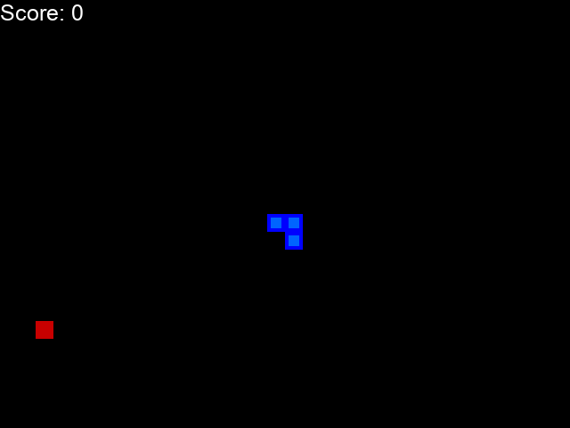
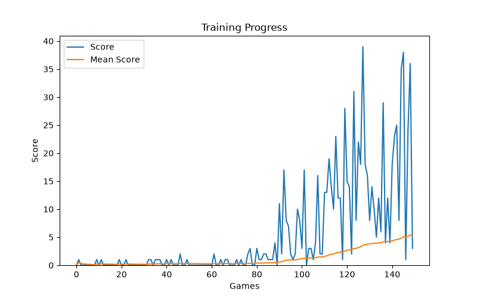

# Snake DQN

A Deep Q-Network agent that learns to play Snake from scratch through reinforcement learning — no hand-coded strategy, just trial, error, and reward.



## How it works

- **Environment** (`game.py`): a standard Snake game built with Pygame. Each step returns a reward (`+10` food, `-10` death, `0` otherwise), whether the episode ended, and the current score.
- **State** (`agent.py`): the board is reduced to an 11-value feature vector — danger straight/left/right, current direction, and food direction relative to the head. This keeps the network tiny and training fast.
- **Model** (`model.py`): a 2-layer fully connected network (11 → 256 → 3) predicting Q-values for the three possible moves (straight, turn right, turn left, relative to heading).
- **Training loop** (`train.py`): standard DQN with experience replay — the agent trains on the most recent transition after every move, then replays a random batch from memory after each game to break correlation between consecutive states.

Epsilon-greedy exploration decays as more games are played, so the agent explores heavily early on and increasingly exploits what it's learned.

## Setup

```bash
python3 -m venv venv
source venv/bin/activate
pip install -r requirements.txt
```

## Train

```bash
python train.py                  # trains forever with the game window visible, Ctrl+C to stop
python train.py --no-render      # trains headless, much faster
python train.py --episodes 150   # stop automatically after N games
```

The best model so far is saved to `model/model.pth` any time a new high score is reached. A live-updating chart of score and rolling mean score is written to `training_progress.png`.

On this setup, ~100 episodes (headless, under 30 seconds) is enough for the agent to consistently score in the high teens/twenties.

## Watch it play

```bash
python play.py                        # watch 5 episodes with the trained model
python play.py --episodes 3 --gif     # also save gameplay to demo.gif
```

## Results



Score climbs steadily as epsilon decays and the agent shifts from random exploration to exploiting what it's learned about avoiding walls, avoiding itself, and chasing food.
